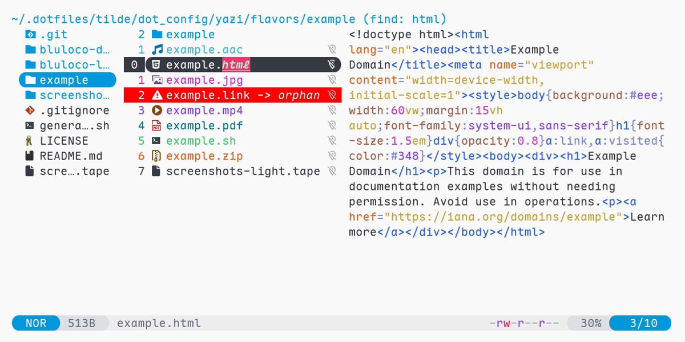

# Bluloco light flavour for [Yazi]

## Preview

Files:



Spotter:

![Spotter][spotter]

Help:

![Help menu][help]

## Installation

```sh
ya pkg add hankertrix/bluloco-yazi:bluloco-light
```

## Usage

Add the section below to your `theme.toml` file,
located at `~/.config/yazi/theme.toml` for Linux and macOS,
and `%AppData%\yazi\config\theme.toml` for Windows.

Note that this is a **light** theme.

```toml
# ~/.config/yazi/theme.toml for Linux and macOS
# %AppData%\yazi\config\theme.toml for Windows
[flavor]
light = "bluloco-light"
```

## Licence

Both the flavour and the included `tmtheme` is licensed under the
[GNU Lesser General Public License v3 (LGPL v3)](LICENSE).
Check the [`LICENSE`](LICENSE) and [`LICENSE-tmtheme`](LICENSE-tmtheme)
files for more information.

<!-- Links -->

[Yazi]: https://github.com/sxyazi/yazi

<!-- Screenshots -->

[spotter]: https://github.com/user-attachments/assets/a030397a-b8b0-4cea-8ce0-a2205e2326d4
[help]: https://github.com/user-attachments/assets/a5b168b6-3860-423b-9a3e-315007a21017
